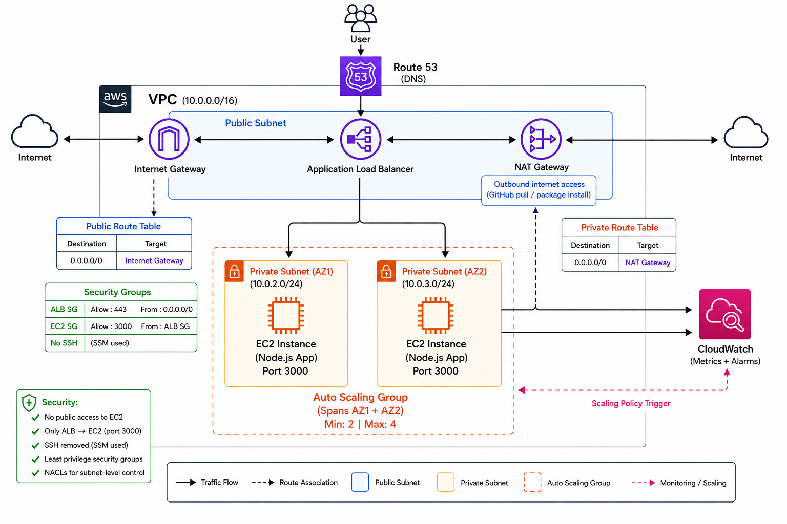
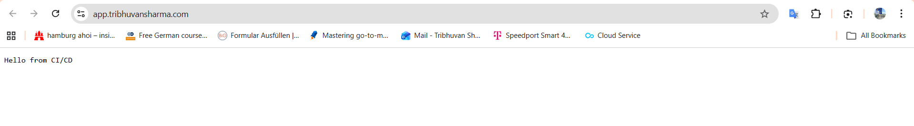

# 🚀 AWS Scalable Web Application (3-Tier Architecture)

---

## 📌 Overview

This project demonstrates a **production-style, scalable, and secure web application architecture on AWS**.

It showcases how to design a **fault-tolerant, stateless system** using load balancing, auto scaling, private networking, and modern deployment practices — eliminating manual SSH-based deployments.

---

## 🌐 Live Demo

👉 https://app.tribhuvansharma.com

---

## 🧱 Architecture



---

## 🧠 Architecture Summary

The system follows a **3-tier architecture pattern**:

Internet → Route 53 → ALB → Auto Scaling Group → EC2 (Private)


---

## 🔹 Key Components

| Layer        | Service                          | Purpose                                      |
|-------------|----------------------------------|----------------------------------------------|
| DNS         | Route 53                         | Domain routing                               |
| Entry       | Application Load Balancer (ALB)  | Handles HTTPS traffic                        |
| Compute     | EC2 (Private Instances)          | Runs Node.js application                     |
| Scaling     | Auto Scaling Group (ASG)         | Ensures availability and scaling             |
| Networking  | VPC + Subnets + Route Tables     | Traffic control and isolation                |
| NAT         | NAT Gateway                      | Enables outbound internet access (private EC2) |
| Access      | AWS Systems Manager (SSM)        | Secure admin access (no SSH)                 |
| Monitoring  | CloudWatch                       | Metrics and scaling triggers                 |

---

## 🌐 Networking Design

This architecture uses a **secure VPC setup**:

- Public Subnet:
  - Application Load Balancer
  - NAT Gateway

- Private Subnet:
  - EC2 Instances (no public IP)

---

### 🔹 Internet Gateway

- Enables communication between VPC and the internet
- Attached to the VPC
- Used by ALB (public access)

---

### 🔹 NAT Gateway

- Placed in **public subnet**
- Allows private EC2 instances to:
  - Pull code from GitHub
  - Install packages
- Prevents inbound internet access

---

### 🔹 Route Tables

| Subnet Type   | Route Configuration |
|--------------|--------------------|
| Public Subnet | 0.0.0.0/0 → Internet Gateway |
| Private Subnet | 0.0.0.0/0 → NAT Gateway |

---

## 🔄 Application Flow

1. User accesses: https://app.tribhuvansharma.com

2. Route 53 resolves domain → ALB

3. ALB receives HTTPS request

4. ALB forwards traffic to:
- EC2 instances in private subnet

5. EC2 instances:
- Run Node.js app (port 3000)
- Managed using PM2

6. Response returned via ALB

---

## ⚙️ Deployment Model (Key Highlight)

This project implements a **stateless deployment architecture**.

---

### 🔹 How it works

Each EC2 instance on launch:

1. Installs dependencies (Node.js, PM2)
2. Pulls latest code from GitHub
3. Starts the application automatically

---

### 🔥 Improvements

| Before | After |
|------|------|
| Manual SSH deployments | Automated via User Data |
| Stateful instances | Stateless infrastructure |
| Inconsistent deployments | Fully reproducible |

---

## 📈 Auto Scaling & Resilience

---

### 🔹 Scale Out

- Trigger: CPU > 60%
- Action: Add instances

---

### 🔹 Scale In

- Trigger: CPU < 42%
- Action: Remove instances

---

### 🔹 Fault Tolerance

- ALB performs health checks
- Unhealthy instances replaced automatically by ASG
- Ensures high availability

---

## 🔐 Security Design

---

### 🔹 Network Security

| Component | Access |
|----------|--------|
| EC2 Instances | ❌ No public access |
| ALB | ✅ Public (HTTPS only) |
| EC2 Port 3000 | ✅ Only from ALB |
| SSH | ❌ Disabled |

---

### 🔹 Access Management

- SSH completely removed
- AWS Systems Manager (SSM) used for access
- IAM role with least privilege

---

### 🔹 Benefits

- Reduced attack surface
- No exposed ports
- Secure, auditable access

---

## 📊 Observability

- CloudWatch Metrics:
- CPU Utilization
- Instance health

- CloudWatch Alarms:
- High CPU → Scale Out
- Low CPU → Scale In

---

## 🧪 Testing & Validation

---

### 🔹 Load Test

```bash
for i in {1..20}; do curl -s https://app.tribhuvansharma.com; done
```

---

### 🔹 Result

Consistent response across all instances:

```
Hello from CI/CD
```

---

### 🔹 Security Validation

| Test              | Result     |
| ----------------- | ---------- |
| Direct EC2 access | ❌ Blocked  |
| SSH access        | ❌ Disabled |
| ALB access        | ✅ Allowed  |
| SSM access        | ✅ Allowed  |

---

## 💰 Cost Optimization

* Removed bastion host
* Auto scaling prevents over-provisioning
* Efficient resource usage via stateless design

---

## 🧠 Key Learnings

* Designing scalable AWS architectures
* Implementing stateless infrastructure
* Replacing SSH with SSM
* Auto scaling using CloudWatch metrics
* Debugging multi-instance inconsistencies
* Applying least-privilege security

---

## ⚠️ Challenges Faced

* Port conflicts from multiple Node processes
* Inconsistent responses across instances
* SSH-based deployment limitations
* Security group misconfigurations
* Load balancer routing issues
* Transitioning to stateless architecture

---

## 🚀 Future Improvements

* Blue/Green deployment strategy
* Docker + ECS/Fargate
* Infrastructure as Code (Terraform)
* Advanced monitoring dashboards
* CI/CD pipeline without SSH

---

## 📂 Project Structure

```
aws-webapp-pvt-ec2/
│
├── app.js
├── deploy.sh
├── architecture.png
├── README.md
```

---

## 👤 Author

Tribhuvan Sharma  
AWS Certified Solutions Architect  
Aspiring Solutions Consultant / Pre-Sales Engineer

---

##  Portfolio Preview


