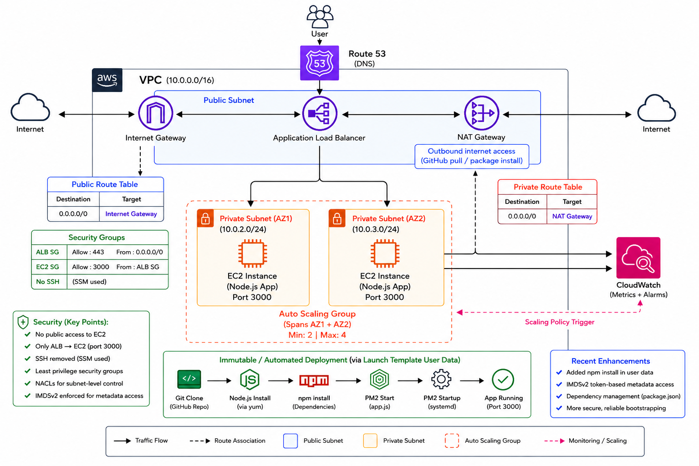
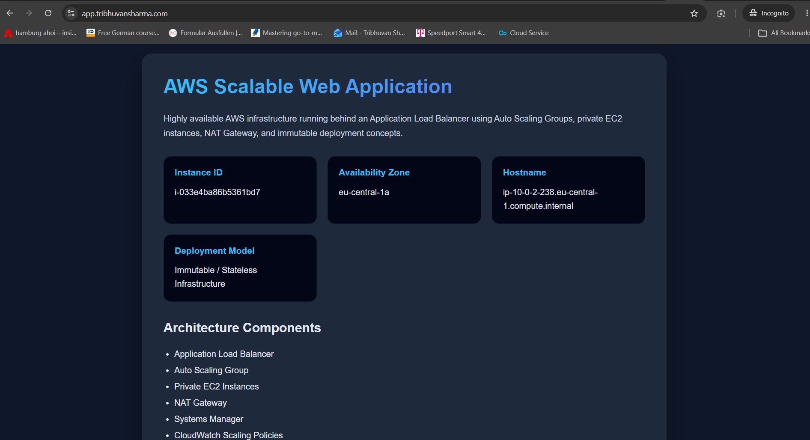

# 🚀 AWS Scalable and Highly Available Web Application

---

## 📌 Overview

This project demonstrates a scalable and highly available AWS web application architecture running on private EC2 instances behind an Application Load Balancer.

The application focuses on infrastructure architecture, immutable deployment concepts, Auto Scaling, and secure cloud networking rather than complex business logic.

The frontend dynamically displays live EC2 instance metadata such as Instance ID, Availability Zone, and Hostname, demonstrating real-time load balancing and Auto Scaling behavior across multiple instances.

The infrastructure uses a stateless deployment model where new EC2 instances automatically bootstrap themselves using Launch Template User Data, GitHub source control, PM2 process management, and dependency installation during instance launch.

---

## 🌐 Live Demo

👉 https://app.tribhuvansharma.com

---

## 🧱 Architecture


> This architecture demonstrates immutable infrastructure deployment principles using Auto Scaling Groups, Launch Template bootstrapping, private EC2 instances, NAT Gateway outbound access, and IMDSv2-secured EC2 metadata retrieval.

---

## 🔹Tech Stack

| Service | Purpose |
|---|---|
| Amazon EC2 | Application hosting |
| Auto Scaling Group | Horizontal scaling & self-healing |
| Application Load Balancer | Traffic distribution |
| Amazon VPC | Network isolation |
| Public & Private Subnets | Secure network segmentation |
| NAT Gateway | Outbound internet access for private instances |
| Internet Gateway | Public internet connectivity |
| Route 53 | DNS routing |
| AWS Systems Manager (SSM) | Secure instance management |
| Amazon CloudWatch | Monitoring & Auto Scaling alarms |
| PM2 | Node.js process management |
| Node.js + Express | Web application runtime |
| GitHub | Source control |

---

# Features

* Highly available AWS web application architecture
* Application Load Balancer distributing traffic across multiple EC2 instances
* Auto Scaling Group spanning multiple Availability Zones
* Private EC2 deployment with no public SSH access
* Stateless / immutable deployment model using Launch Template User Data
* Dynamic infrastructure dashboard displaying live EC2 metadata
* Real-time display of:
  * EC2 Instance ID
  * Availability Zone
  * Hostname
* IMDSv2-secured metadata retrieval
* NAT Gateway outbound internet access for package installation and GitHub repository cloning
* PM2 process management for application resiliency
* CloudWatch-based Auto Scaling policies
* Secure network segmentation using public and private subnets
* Route 53 custom domain integration
* HTTPS-enabled application delivery
* GitHub-based source control and deployment workflow
* Self-healing infrastructure through Auto Scaling instance replacement
* Security Group-based least-privilege access controls
* Systems Manager (SSM) used instead of public SSH access
* Infrastructure-focused architecture demonstrating real-world AWS design patterns

---

## 🌐 Networking Design

This architecture uses a **secure VPC setup**:

- Public Subnet:
  - Application Load Balancer
  - NAT Gateway

- Private Subnet:
  - EC2 Instances (no public IP)

---

### 🔹 Internet Gateway

- Enables communication between VPC and the internet
- Attached to the VPC
- Used by ALB (public access)

---

### 🔹 NAT Gateway

- Placed in **public subnet**
- Allows private EC2 instances to:
  - Pull code from GitHub
  - Install packages
- Prevents inbound internet access

---

### 🔹 Route Tables

| Subnet Type   | Route Configuration |
|--------------|--------------------|
| Public Subnet | 0.0.0.0/0 → Internet Gateway |
| Private Subnet | 0.0.0.0/0 → NAT Gateway |

---

## 🔄 Application Flow

1. User accesses the application via Route 53
2. Traffic is routed to the Application Load Balancer (ALB)
3. ALB distributes requests across private EC2 instances in multiple Availability Zones
4. EC2 instances serve the Node.js application running on port 3000
5. The application dynamically retrieves EC2 metadata using IMDSv2
6. Auto Scaling Groups manage instance scaling and replacement
7. NAT Gateway provides outbound internet access for package installation and GitHub repository cloning
8. CloudWatch monitors infrastructure metrics and triggers scaling policies

---

## ⚙️ Deployment Model (Key Highlight)

This project implements a **stateless deployment architecture**.

---

### 🔹 How it works

Each EC2 instance on launch:

1. Installs dependencies (Node.js, PM2)
2. Pulls latest code from GitHub
3. Starts the application automatically

---

### 🔥 Improvements

| Before | After |
|------|------|
| Manual SSH deployments | Automated via User Data |
| Stateful instances | Stateless infrastructure |
| Inconsistent deployments | Fully reproducible |

---

## 📈 Auto Scaling & Resilience

---

### 🔹 Scale Out

- Trigger: CPU > 60%
- Action: Add instances

---

### 🔹 Scale In

- Trigger: CPU < 42%
- Action: Remove instances

---

### 🔹 Fault Tolerance

- ALB performs health checks
- Unhealthy instances replaced automatically by ASG
- Ensures high availability

---

## 🔐 Security Design

---

### 🔹 Network Security

| Component | Access |
|----------|--------|
| EC2 Instances | ❌ No public access |
| ALB | ✅ Public (HTTPS only) |
| EC2 Port 3000 | ✅ Only from ALB |
| SSH | ❌ Disabled |

---

### 🔹 Access Management

- SSH completely removed
- AWS Systems Manager (SSM) used for access
- IAM role with least privilege
- IMDSv2 enforced for secure metadata access

---

### 🔹 Benefits

- Reduced attack surface
- No exposed ports
- Secure, auditable access

---

## 📊 Observability

- CloudWatch Metrics:
- CPU Utilization
- Instance health

- CloudWatch Alarms:
- High CPU → Scale Out
- Low CPU → Scale In

---

## 🧪 Testing & Validation

---

### 🔹 Load & Routing Test

```bash
for i in {1..20}; do curl -s https://app.tribhuvansharma.com; done
```

---

### 🔹 Validation Goals

The test was used to validate:

* Application Load Balancer traffic distribution
* Auto Scaling Group instance availability
* Stateless application behavior
* Dynamic EC2 metadata retrieval
* Immutable deployment consistency across instances

---

### 🔹 Observed Behavior

Repeated requests returned dynamically changing infrastructure metadata depending on which EC2 instance served the request.

Validated fields included:

* EC2 Instance ID
* Availability Zone
* Hostname

Example observations:

```text
Instance ID:
i-xxxxxxxxxxxxx

Availability Zone:
eu-central-1a
```

and

```text
Instance ID:
i-yyyyyyyyyyyyy

Availability Zone:
eu-central-1b
```

This demonstrated successful ALB request routing across multiple Auto Scaling Group instances while maintaining consistent application behavior.

---

### 🔹 IMDSv2 Validation

The application successfully retrieved EC2 metadata using IMDSv2 token-based authentication, validating secure metadata access configuration on dynamically provisioned EC2 instances.

---

### 🔹 Security Validation

| Test              | Result     |
| ----------------- | ---------- |
| Direct EC2 access | ❌ Blocked  |
| SSH access        | ❌ Disabled |
| ALB access        | ✅ Allowed  |
| SSM access        | ✅ Allowed  |

---

## 💰 Cost Optimization

* Removed bastion host
* Auto scaling prevents over-provisioning
* Efficient resource usage via stateless design

---

## ♻️ Immutable Deployment ArchitectureImmutable Deployment Architecture

The project evolved from an earlier SSH/bastion-based deployment model into a fully stateless infrastructure design.

Current deployment flow:

Launch Template User Data
→ Install dependencies
→ Clone GitHub repository
→ Install Node.js packages
→ Start application using PM2

New EC2 instances are automatically provisioned and configured during Auto Scaling events without requiring manual SSH access or server-specific configuration.

This approach follows modern cloud infrastructure best practices often referred to as:

* Immutable Infrastructure
* Cattle not Pets
* Stateless Deployments

---

## 🔐 EC2 Metadata Security (IMDSv2)

The application retrieves live EC2 instance metadata such as:

* Instance ID
* Availability Zone
* Hostname

using the EC2 Instance Metadata Service Version 2 (IMDSv2).

IMDSv2 improves security by requiring temporary session tokens for metadata access instead of unauthenticated metadata requests.

---

## 🧠 Key Learnings

* Designing scalable AWS architectures
* Implementing stateless infrastructure
* Replacing SSH with SSM
* Auto scaling using CloudWatch metrics
* Debugging multi-instance inconsistencies
* Applying least-privilege security
* Designing immutable infrastructure deployments
* Building highly available Multi-AZ architectures
* Using Launch Template User Data for stateless provisioning
* Implementing IMDSv2-secured metadata retrieval
* Auto Scaling Group instance refresh workflows
* Real-world cloud debugging and operational troubleshooting

---

## ⚠️ Challenges Faced

* Port conflicts from multiple Node processes
* Inconsistent responses across instances
* SSH-based deployment limitations
* Security group misconfigurations
* Load balancer routing issues
* Transitioning to stateless architecture
* Migrating from mutable SSH deployments to immutable infrastructure
* Handling stale Node.js processes across instance replacements
* Debugging PM2 startup persistence
* Implementing dependency installation during bootstrapping
* Troubleshooting IMDSv2 metadata access failures
* Managing Auto Scaling Group rolling refresh behavior

---

## 🚀 Future Improvements

* Blue/Green deployment strategy
* Docker + ECS/Fargate
* Infrastructure as Code (Terraform)
* Advanced monitoring dashboards
* CI/CD pipeline without SSH
* Containerize application using Docker
* Migrate deployment to ECS Fargate
* Introduce Infrastructure as Code using Terraform
* Add CI/CD pipeline using GitHub Actions
* Add centralized logging aggregation
* Introduce blue/green deployment strategy

---

## 📂 Project Structure

```
aws-webapp-pvt-ec2/
│
├── app.js
├── deploy.sh
├── architecture.png
├── README.md
```

---

## 👤 Author

Tribhuvan Sharma  
AWS Certified Solutions Architect  
Aspiring Solutions Consultant / Pre-Sales Engineer

---

## Infrastructure Dashboard Preview


